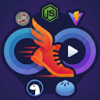
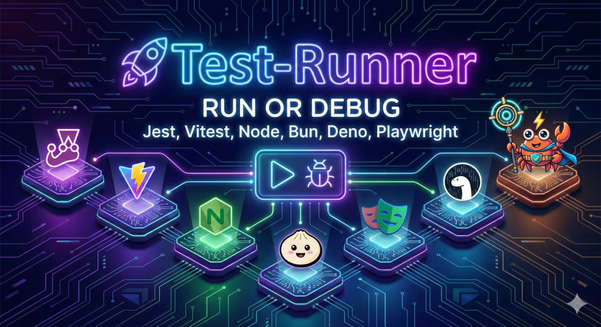

<div align="center">



# Jest Runner for Visual Studio Code

**Run and debug Jest, Vitest, Playwright, Rstest, Bun, Deno and Node.js tests right from your editor. One click, zero configuration.**

[](https://marketplace.visualstudio.com/items?itemName=firsttris.vscode-jest-runner)
[](https://marketplace.visualstudio.com/items?itemName=firsttris.vscode-jest-runner)
[](https://marketplace.visualstudio.com/items?itemName=firsttris.vscode-jest-runner)
[](https://open-vsx.org/extension/firsttris/vscode-jest-runner)
[](https://github.com/firsttris/vscode-jest-runner/actions/workflows/ci.yml)
[](https://codecov.io/gh/firsttris/vscode-jest-runner)
[](LICENSE)

[Install](#install) •
[Quick Start](#quick-start) •
[Features](#features) •
[Supported Frameworks](#supported-test-frameworks) •
[Configuration](#configuration) •
[Documentation](https://firsttris.github.io/vscode-jest-runner/) •
[FAQ](#faq)



</div>

---

## What is Jest Runner?

**Jest Runner** is a lightweight Visual Studio Code extension that lets you **run a single test, a describe block or a whole test file** without leaving the editor. It adds **Run** and **Debug** actions above every test (CodeLens), a native **Test Explorer** with **code coverage**, context menu entries and commands for the keyboard.

It started as a Jest test runner and grew into a **universal JavaScript and TypeScript test runner for VS Code**: it detects whether a file belongs to **Jest, Vitest, Playwright, Rstest, Bun, Deno or the Node.js test runner** and builds the right command for it. Monorepos, multiple configs, Create React App, Nx, Next.js, NestJS and Vite projects work out of the box.

> 💡 **Why not the built-in runner of each framework?** Jest Runner runs the *real* CLI of your project in a terminal or the debugger, with your config, your environment and your Node version. Nothing is emulated, so what passes here passes in CI.

## Install

Search for **Jest Runner** in the Extensions view (`Ctrl+Shift+X` / `Cmd+Shift+X`), or install from the command line:

```bash
code --install-extension firsttris.vscode-jest-runner
```

Also available on [Open VSX](https://open-vsx.org/extension/firsttris/vscode-jest-runner) for VSCodium, Cursor, Windsurf, Gitpod and other VS Code based editors. Requires VS Code 1.100 or newer.

## Quick Start

1. Open a project that uses one of the [supported test frameworks](#supported-test-frameworks).
2. Open a test file. **Run** and **Debug** appear above each `describe`, `it` and `test`.
3. Click **Run** to execute that test in the integrated terminal, or **Debug** to hit your breakpoints.

That is all. Jest Runner reads your `jest.config.*`, `vitest.config.*`, `playwright.config.*`, `rstest.config.*` or `deno.json` to find your tests, so there is nothing to configure in most projects.

Want the tree view? Enable the native Test Explorer:

```json
"jestrunner.enableTestExplorer": true
```

## Features

<table>
<tr>
<td width="50%" valign="top">

### 🚀 Run & Debug

- **Run a single test**, a `describe` block, a file or a folder
- **Debug with breakpoints**, variable inspection and the call stack
- **Watch mode** for automatic re-runs while you code
- **Update snapshots** with one command
- **Re-run the previous test** with a keyboard shortcut

</td>
<td width="50%" valign="top">

### 📊 Coverage

- **Inline coverage** in the editor via the VS Code coverage API
- **Coverage view** with statement, branch and function counts
- Works with **Jest, Vitest, Rstest, Node.js, Bun and Deno**
- Coverage for the **current file only** on demand

</td>
</tr>
<tr>
<td width="50%" valign="top">

### 🧭 Five ways to start a test

- **CodeLens** actions above every test
- **Test Explorer** with the full test hierarchy
- **Context menu** in the editor and the file explorer
- **Command Palette** commands
- **Keyboard shortcuts** you bind yourself

</td>
<td width="50%" valign="top">

### 🧠 Smart detection

- **Automatic framework detection** per file: imports, config files, dependencies and binaries
- **Reads your config**: `testMatch`, `testRegex`, `include`, `exclude`, `roots`, `testDir`, `projects` and more
- **Parameterized tests**: `it.each`, `describe.each`, `test.each` with `%s`, `$name` and `%#`
- **Monorepos**: per-package configs, Jest and Vitest side by side, glob mapped configs

</td>
</tr>
</table>

## Supported Test Frameworks

| Framework | Run | Debug | Coverage | How it is detected |
|---|:-:|:-:|:-:|---|
| [Jest](https://jestjs.io/) | ✅ | ✅ | ✅ | `jest.config.*`, `jest` key in `package.json`, dependency or binary |
| [Vitest](https://vitest.dev/) | ✅ | ✅ | ✅ | `vitest.config.*` or `vite.config.*` with a `test` section, dependency or binary |
| [Playwright](https://playwright.dev/) | ✅ | ✅ | — | `import ... from '@playwright/test'`, `playwright.config.*` |
| [Rstest](https://rstest.rs/) | ✅ | ✅ | ✅ | `import ... from '@rstest/core'`, `rstest.config.*` |
| [Bun test](https://bun.sh/docs/cli/test) | ✅ | ✅ ¹ | ✅ | `import ... from 'bun:test'`, `bun.lock` |
| [Deno test](https://docs.deno.com/runtime/fundamentals/testing/) | ✅ | ✅ | ✅ | `Deno.test(...)`, `@std/assert` imports, `deno.json` |
| [Node.js test runner](https://nodejs.org/api/test.html) | ✅ | ✅ | ✅ | `import ... from 'node:test'` |

¹ Debugging Bun tests needs the [Bun for Visual Studio Code](https://marketplace.visualstudio.com/items?itemName=Oven.bun-vscode) extension.

Jest Runner also works with the tools built on top of these frameworks: **Create React App**, **Vite**, **Nx**, **Next.js**, **NestJS**, **TanStack Start** and other setups that wrap one of these runners. See [Supported Test Frameworks](https://firsttris.github.io/vscode-jest-runner/frameworks.html) in the documentation for what is read from each config file.

## Configuration

Most projects need no settings. When you do, every option lives under `jestrunner.*` in your VS Code settings. The most used ones:

| Setting | What it does |
|---|---|
| `jestrunner.enableTestExplorer` | Show tests in the native Test Explorer with run, debug and coverage profiles. Default `false`. |
| `jestrunner.enableCodeLens` / `jestrunner.codeLens` | Show the inline actions and choose which: `run`, `debug`, `watch`, `coverage`, `current-test-coverage`. |
| `jestrunner.jestCommand`, `vitestCommand`, `playwrightCommand`, `rstestCommand`, `nodeTestCommand` | Replace the command, e.g. `npm run test --` for Create React App. Supports `${workspaceFolder}` and `${env:NAME}`. |
| `jestrunner.runOptions`, `vitestRunOptions`, `playwrightRunOptions`, ... | Extra CLI flags for each framework, e.g. `["--coverage", "--colors"]`. |
| `jestrunner.debugOptions`, `vitestDebugOptions`, ... | Add or override the generated VS Code debug configuration. |
| `jestrunner.configPath` / `jestrunner.vitestConfigPath` | A config path, or a glob-to-config mapping for several configs in one workspace. |
| `jestrunner.projectPath` | Run tests from a sub folder instead of the workspace root. |
| `jestrunner.useNearestConfig` | Use the closest config file above the test file. Handy for nested projects. |
| `jestrunner.disableFrameworkConfig` / `jestrunner.defaultTestPatterns` | Skip config parsing and use your own test file globs. |
| `jestrunner.enableESM` | Add `--experimental-vm-modules` for ESM projects on Jest. |

The complete list of all settings with examples is in the [Settings Reference](https://firsttris.github.io/vscode-jest-runner/configuration.html). Ready-made setups for Create React App, nvm, ESM, monorepos and Windows shells are in the [Recipes](https://firsttris.github.io/vscode-jest-runner/recipes.html).

### Keyboard shortcuts

Jest Runner ships no default keybindings so it never collides with yours. Add what you need in **Preferences: Open Keyboard Shortcuts (JSON)**:

```json
{ "key": "alt+1", "command": "extension.runJest" },
{ "key": "alt+2", "command": "extension.debugJest" },
{ "key": "alt+3", "command": "extension.watchJest" },
{ "key": "alt+4", "command": "extension.runPrevJest" }
```

### Commands

All commands keep their historic `Jest` names, but each one runs the framework of the current file.

| Command | ID | What it runs |
|---|---|---|
| Run Jest / Debug Jest | `extension.runJest`, `extension.debugJest` | The test at the cursor (or the selected text as test name) |
| Run Jest on File | `extension.runJestFile` | The whole file |
| Run Jest on Path / Debug Jest on Path | `extension.runJestPath`, `extension.debugJestPath` | A file or folder from the explorer context menu |
| Run Jest --watch | `extension.watchJest` | The test at the cursor in watch mode |
| Run Jest and generate Coverage | `extension.runJestCoverage` | The test at the cursor with `--coverage` |
| Run Jest and update Snapshots | `extension.runJestAndUpdateSnapshots` | The test at the cursor with `-u` |
| Run Jest - Run Previous Test | `extension.runPrevJest` | Repeats the last run or debug session |

## Good to know

- **Config files are parsed, not executed.** Jest Runner reads `testMatch`, `testRegex`, `include`, `exclude`, `roots`, `testDir` and `projects` with a static parser that understands literals, local variables, `require()` of local files and wrappers such as `defineConfig`. Configs built at runtime (package imports, conditions, `process.env`) fall back to the default patterns; set `jestrunner.disableFrameworkConfig` and `jestrunner.defaultTestPatterns` in that case.
- **Coverage in the editor** needs the Test Explorer. Jest, Rstest, Node.js, Bun and Deno work without setup; Vitest needs `@vitest/coverage-v8` or `@vitest/coverage-istanbul` installed and `coverage.provider` set in its config. The report directory is read from `coverageDirectory` / `reportsDirectory`, otherwise `coverage/`.
- **Debugging Bun tests** requires the [Bun for Visual Studio Code](https://marketplace.visualstudio.com/items?itemName=Oven.bun-vscode) extension; everything else uses the built-in JavaScript debugger.
- **Parameterized tests** (`it.each`, `test.each`, `describe.each`) get one entry per row when the table is a literal in the file, with `%s`, `%i`, `%#`, `$name` and `$obj.prop` filled in. Dynamic names such as `it(MyClass.prototype.method.name, ...)` work too.
- **Logs** of what was detected and which command was started go to the **Jest Runner** output channel. Turn on `jestrunner.enableDebugLogs` before reporting a bug.

## Documentation

The full documentation lives at **[firsttris.github.io/vscode-jest-runner](https://firsttris.github.io/vscode-jest-runner/)**:

| For users | For contributors |
|---|---|
| [Getting Started](https://firsttris.github.io/vscode-jest-runner/getting-started.html) | [Architecture](https://firsttris.github.io/vscode-jest-runner/architecture.html) |
| [Running & Debugging Tests](https://firsttris.github.io/vscode-jest-runner/usage.html) | [Test Detection](https://firsttris.github.io/vscode-jest-runner/internals/test-detection.html) |
| [Supported Test Frameworks](https://firsttris.github.io/vscode-jest-runner/frameworks.html) | [Command Building & Execution](https://firsttris.github.io/vscode-jest-runner/internals/execution.html) |
| [Settings Reference](https://firsttris.github.io/vscode-jest-runner/configuration.html) | [Reporters & Result Matching](https://firsttris.github.io/vscode-jest-runner/internals/results.html) |
| [Recipes](https://firsttris.github.io/vscode-jest-runner/recipes.html) | [Module Reference](https://firsttris.github.io/vscode-jest-runner/internals/module-reference.html) |
| [Troubleshooting & FAQ](https://firsttris.github.io/vscode-jest-runner/troubleshooting.html) | [Development & Release](https://firsttris.github.io/vscode-jest-runner/development.html) |

The same pages are browsable in the [docs folder](docs/README.md) of this repository.

## FAQ

<details>
<summary><b>Does Jest Runner replace the official Jest, Vitest or Playwright extension?</b></summary>
<br>

It can. Jest Runner is deliberately small: it does not watch your whole project in the background or run tests on save. It runs exactly the test you ask for, through the real CLI, and shows the result in the terminal or the Test Explorer. If you only want a fast way to run and debug a single test, this is it.

</details>

<details>
<summary><b>How does it know whether a file is a Jest or a Vitest test?</b></summary>
<br>

Per file. Jest Runner first looks at the imports (`bun:test`, `node:test`, `@playwright/test`, `@rstest/core`, `Deno.test`), then walks up the directories looking for `jest.config.*`, `vitest.config.*` or `vite.config.*`, then checks `package.json` dependencies and installed binaries. When both Jest and Vitest configs exist, the `testMatch` and `include` patterns decide. Details are in [Test Detection](https://firsttris.github.io/vscode-jest-runner/internals/test-detection.html).

</details>

<details>
<summary><b>My tests do not show up or the wrong framework is used.</b></summary>
<br>

Enable `jestrunner.enableDebugLogs` and open the **Jest Runner** output channel: it logs which config was read and which patterns were applied. Config files are read by a static parser that does not execute code, so a config built at runtime may not be understood. In that case set `jestrunner.disableFrameworkConfig: true` and list your test globs in `jestrunner.defaultTestPatterns`. More in [Troubleshooting](https://firsttris.github.io/vscode-jest-runner/troubleshooting.html).

</details>

<details>
<summary><b>Does it work on Windows, with PowerShell, cmd and Git Bash?</b></summary>
<br>

Yes. Test names are quoted for the shell of your integrated terminal, `.cmd` shims such as `npx` are started through `cmd.exe` where needed, long command lines are split and the whole process tree is killed on cancel. The end-to-end tests run on Windows, macOS and Linux in CI.

</details>

<details>
<summary><b>Does it support ESM projects?</b></summary>
<br>

Vitest, Bun, Deno and the Node.js runner are ESM-native. For Jest set `jestrunner.enableESM: true`, which adds `--experimental-vm-modules` to `NODE_OPTIONS` for runs and debug sessions.

</details>

## Contributing

Bug reports, feature requests and pull requests are welcome. Start with the [open issues](https://github.com/firsttris/vscode-jest-runner/issues) or read [Development & Release](https://firsttris.github.io/vscode-jest-runner/development.html) to build, test and debug the extension locally:

```bash
git clone https://github.com/firsttris/vscode-jest-runner.git
cd vscode-jest-runner
npm ci
npm test        # unit tests
npm run build   # bundle to dist/extension.js, then press F5 in VS Code
```

## License

[MIT](LICENSE) © Tristan Teufel and contributors.

---

<div align="center">

⭐ Star the project on [GitHub](https://github.com/firsttris/vscode-jest-runner) • 🐛 [Report a bug](https://github.com/firsttris/vscode-jest-runner/issues/new?template=bug_report.md) • 💡 [Request a feature](https://github.com/firsttris/vscode-jest-runner/issues/new?template=feature_request.md)

</div>
