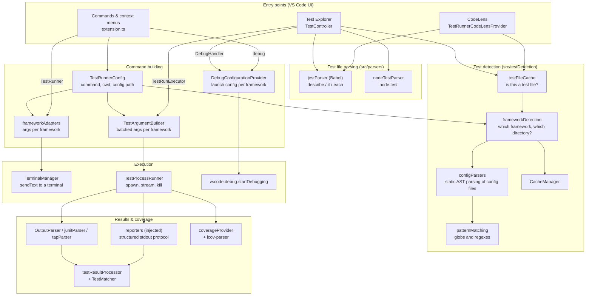
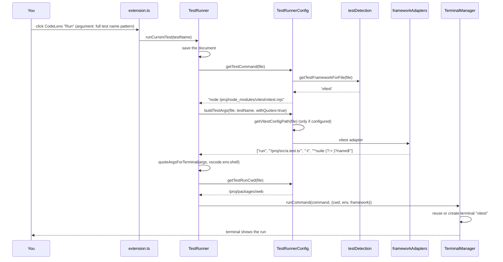
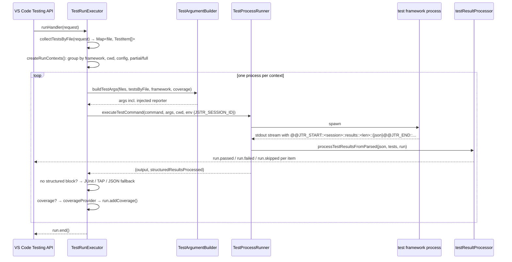

# Architecture

Jest Runner is a single VS Code extension host process, bundled by Vite into `dist/extension.js`. It has no
background server and no long-running watcher of its own: it reacts to what you click, builds a command for
the test framework of that file, runs it, and (in the Test Explorer) reads the results back. This page gives the
big picture; the pages under *Internals* follow each part down to the functions.

## The big picture



Read it top to bottom:

1. **Entry points** decide *what* to run: a test name at the cursor, a file, a folder, or a selection of
   test items.
2. **Test detection** decides *which framework* a file belongs to and *from which directory* it runs. It is
   the heart of the extension and the reason it works without settings.
3. **Test file parsing** turns a file into a tree of `describe` and `it` blocks with line numbers, for the
   CodeLens positions, the Test Explorer tree and the "test at the cursor" lookup.
4. **Command building** assembles the executable, the arguments and the working directory, once for the
   terminal (one test), once for the Test Explorer (many files, batched), and once for the debugger.
5. **Execution** either types the command into a terminal, spawns a process and streams its output, or hands
   a launch configuration to VS Code.
6. **Results & coverage** only exist for the Test Explorer: injected reporters write a structured block to
   stdout, which is matched back to the test items; coverage reports are converted for the VS Code coverage API.

## Two run paths

The terminal path and the Test Explorer path share detection, parsing and configuration, but differ in how
they run and what they know afterwards.

| | Terminal path (CodeLens, commands) | Test Explorer path |
|---|---|---|
| Orchestrator | `TestRunner` | `TestRunExecutor` |
| Scope | one test, one file or one path | any selection across files, packages and frameworks |
| Arguments | `frameworkAdapters` via `TestRunnerConfig.buildTestArgs` | `TestArgumentBuilder` strategies, which reuse the adapters for single-file runs |
| Quoting | for the shell of the integrated terminal (`quoteArgsForTerminal`) | none: args go straight to `spawn`, except on Windows through `cmd.exe` |
| Process | `TerminalManager` sends the text to a reused terminal | `TestProcessRunner` spawns, streams, enforces a buffer limit, kills the tree on cancel |
| Results | you read the terminal | reporters → `testResultProcessor` → `run.passed()` / `run.failed()` |
| Coverage | the framework writes its report | report is read back into the coverage view |
| Debug | `DebugConfigurationProvider` | `DebugConfigurationProvider` (same) |

The debugger is the third path: both orchestrators call `getDebugConfiguration()`, which builds a VS Code
launch configuration with the same arguments that a run would use, and `vscode.debug.startDebugging` does
the rest.

## What happens when you click "Run" on a test



The CodeLens already carries the test name as a **regular expression**: `TestRunnerCodeLensProvider` builds it
from the parsed tree (parent `describe` names joined with spaces, special characters escaped, `%s` and
`$var` placeholders replaced by `(.*?)`, a `describe` extended with `(\s[\s\S]*)?` to match its children).
The adapter anchors it (`^...$`) and the framework-specific flag (`-t`, `-g`, `--filter`,
`--test-name-pattern`) carries it.

## What happens when the Test Explorer runs a folder



## Design decisions

**Per-file framework detection.** There is no "project framework". Every file is classified on its own by
its imports first and its surroundings second. That is what makes a monorepo with Jest in one package and
Vitest in another, or a Playwright suite next to unit tests, work with no settings. The cost is a lot of file
system lookups, which `CacheManager` keeps cheap: directory-level results (does this directory use Jest?),
file-level results (framework and directory of this file) and config lookups are cached until a config file
or a setting changes.

**Config files are parsed, not executed.** Running a `jest.config.ts` would need the project's TypeScript
loader, its dependencies and its environment, inside the extension host. Instead `parseUtils` walks the Babel
AST and evaluates the subset that configs normally use. The trade-off is documented in
[Config File Parsing](internals/config-parsing.md); the escape hatch is `jestrunner.disableFrameworkConfig`.

**Results come from injected reporters, not from parsing console output.** Console output differs between
versions and reporters and is interleaved with the program's own logs. The extension writes three tiny
reporter files to the temp directory (`jest-reporter.cjs`, `vitest-reporter.cjs`, `node-reporter.mjs`) and
passes them on the command line. They emit one framed JSON block tagged with a per-run session id, so the
parser can find it in any amount of noise and never confuses two concurrent runs. Frameworks without a reporter
API produce JUnit XML (Rstest, Bun, Deno) or JSON (Playwright) instead. Details in
[Reporters & Result Matching](internals/results.md).

**One shape for every result.** All parsers produce the Jest `--json` shape (`JestResults` with
`testResults[].assertionResults[]`), so `testResultProcessor` and `TestMatcher` work for every framework.

**Batching with care.** A Test Explorer run of many files starts as few processes as possible, but a test name
filter applies to the whole process. So files that are only partially selected are kept out of the process of
fully selected files, and frameworks that cannot filter by file list on Windows are split in halves when the
command line gets too long. See [Command Building & Execution](internals/execution.md).

**The terminal path trusts the shell, the spawn path avoids it.** In the terminal, the user's shell is the
runtime, so arguments are quoted for that shell (PowerShell, cmd.exe, Git Bash, POSIX). When spawning, the
arguments go to the process directly and are unquoted first; only Windows `.cmd` shims force a `cmd.exe` in
between, with its own quoting rules.

## Source layout

```
src/
├── extension.ts                  activation, commands, context keys, Test Explorer lifecycle
├── testRunner.ts                 terminal path orchestrator (run / debug / previous)
├── testRunnerConfig.ts           commands, cwd, config paths, arg building facade
├── frameworkAdapters.ts          per-framework CLI argument builders (single file)
├── TerminalManager.ts            the reused terminal
├── TestRunnerCodeLensProvider.ts CodeLens actions incl. each-menus
├── TestController.ts             Test Explorer controller: profiles, discovery refresh
├── testDiscovery.ts              workspace scan and test item tree
├── testResultProcessor.ts        results → TestRun states
├── testResultTypes.ts            the JestResults shape
├── coverageProvider.ts           coverage reports → VS Code coverage API
├── ConfigResolver.ts             jestrunner.configPath / nearest config resolution
├── parser.ts                     chooses the test file parser
├── util.ts                       CodeLens option validation
├── cache/CacheManager.ts         all detection caches
├── config/Settings.ts            typed access to jestrunner.* settings
├── debug/DebugConfigurationProvider.ts  launch configs per framework
├── execution/                    Test Explorer run path
│   ├── TestArgumentBuilder.ts    batched args per framework (strategies)
│   ├── TestCollector.ts          request → tests by file, partial selection
│   └── TestProcessRunner.ts      spawn, stream, buffer limit, kill tree
├── matchers/TestMatcher.ts       result ↔ test item matching
├── parsers/                      test files and runner output
│   ├── jestParser/               Babel-based describe/it/each parser
│   ├── nodeTestParser.ts         node:test parser
│   ├── OutputParser.ts           Jest / Vitest --json output
│   ├── junitParser.ts            JUnit XML (Rstest, Bun, Deno)
│   ├── tapParser.ts              TAP (Node.js fallback)
│   └── lcov-parser.ts            LCOV (Node.js, Bun, Deno coverage)
├── reporters/                    the injected reporters + where they are written
├── reporting/structuredOutput.ts the framing protocol of the reporters
├── testController/               Test Explorer helpers
│   ├── TestRunExecutor.ts        run & coverage handler, grouping, Windows limits
│   ├── DebugHandler.ts           debug profile
│   ├── TestFileWatcher.ts        keeps the tree in sync with files
│   └── TestConfigWatcher.ts      re-discovers on config / setting changes
├── testDetection/                framework & test file detection
│   ├── frameworkDefinitions.ts   names, config files, binaries, default patterns
│   ├── frameworkDetection.ts     which framework, which directory
│   ├── testFileDetection.ts      which patterns, does the file match
│   ├── testFileCache.ts          the cached "is test file" decision
│   ├── configParsing.ts          config path lookup, custom config validation
│   ├── patternMatching.ts        glob / regex matching, Jest-vs-Vitest tie break
│   └── configParsers/            jest, vitest, playwright, rstest, deno, cypress + parseUtils
├── utils/                        paths, shells, args, test names, variables, logging
├── test/                         unit tests (Jest) with a full vscode mock
└── e2e/                          end-to-end tests with real Jest and Vitest processes
```

The [Module Reference](internals/module-reference.md) describes every file with its exports and its callers.
