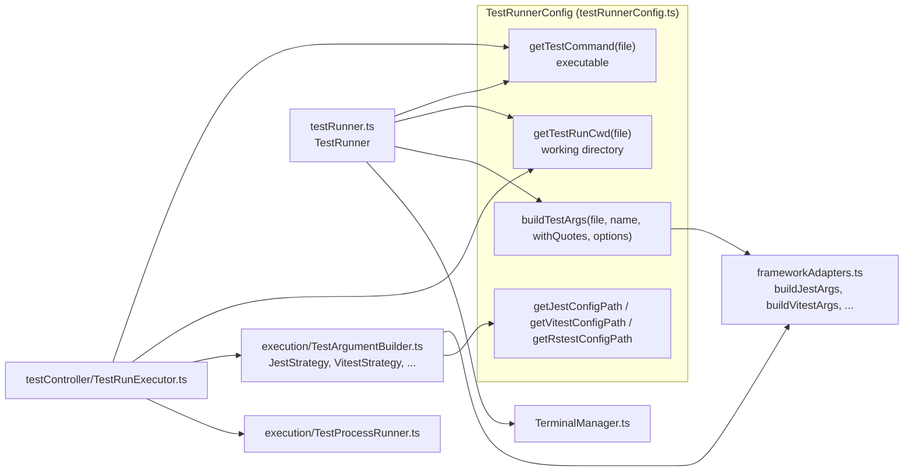

# Command Building & Execution

Once a file and its framework are known, Jest Runner has to produce a command line and run it. Three callers
need that: the terminal path (one test or file), the Test Explorer (many files, batched) and the debugger
(a launch configuration, see [Debugging](debugging.md)). This page follows the first two.

## The pieces

### `TestRunnerConfig`: the facade

One instance per entry point (`extension.ts` creates one for the terminal path, `TestController` one for the
Test Explorer). It wraps `config/Settings.ts` and the detection modules and answers:

- **`getTestCommand(file)`**: the executable. For Jest, Vitest and Rstest it is the `*Command` setting (with
  `${workspaceFolder}` and friends resolved), else the package's binary found with `resolveBinaryPath` from
  the working directory (`node <path/to/jest.js>`), else `npx --no-install <name>`. Playwright is
  `npx playwright`, Node.js is `node`, Bun and Deno are `bun` and `deno`.
- **`getCwd(file)` / `getTestRunCwd(file)`**: see [Test Detection](test-detection.md#config-path-resolution-for-a-run).
- **`get*ConfigPath(file)`**: the config to pass explicitly, usually empty.
- **`buildTestArgs(file, testName, withQuotes, options)`**: dispatches to the framework's adapter with the
  config path and the framework's `*RunOptions`.
- **`getEnvironmentForRun(file)`**: `NODE_OPTIONS=--experimental-vm-modules` when `jestrunner.enableESM` is on.

### `frameworkAdapters.ts`: one file, one test

Pure functions `(file, testName, withQuotes, options, configPath, runOptions) → string[]`, one per
framework. They are the single source of truth for "how do I run file X, test Y with framework Z" and are used
directly by the terminal path and, for single-file runs, by the Test Explorer and the debugger. In summary:

| Framework | Arguments |
|---|---|
| jest | `<file as escaped regex> [-c <config>] [-t ^name$] options runOptions` |
| vitest | `[run] <file> [--config <config>] [-t ^name$] options runOptions`; `run` only without `--watch`; the name pattern allows ` > ` between levels (Vitest 5) |
| node-test | `--test [--test-reporter <node-reporter.mjs> --test-reporter-destination stdout] [--test-name-pattern ^name$] options [coverage reporters] <file>` |
| bun | `test [-t ^name$] [--coverage --coverage-reporter=lcov] options runOptions <file>` |
| deno | `test --allow-all [--filter ^name$] --junit-path=.deno-report.xml options runOptions [--coverage=coverage] <file>` |
| playwright | `test [-g name] options runOptions <file>` |
| rstest | `[--config <config>] <file> [-t ^name$] options runOptions` |

`withQuotes` decides whether the file path and the name are wrapped by `quote()` (single quotes on POSIX,
doubled double quotes on Windows). The terminal path needs quotes (the shell splits the line); the spawn and
debug paths pass `false`, or unquote again, because arguments go to the process as an array.

`appendUniqueArgs` / `prependUniqueArgs` (`utils/ArgUtils.ts`) merge option lists without duplicating a flag
and keep a flag together with its value (`-t x`, `--config y`, `--reporter z`), so a `--coverage` from the
CodeLens and a `--coverage` from `runOptions` appear once.

## The terminal path

`TestRunner` (`testRunner.ts`) handles every command registered in `extension.ts`:

1. The document is saved.
2. The test name comes from the CodeLens argument, from the editor selection (unquoted), or from the parsed
   tree at the cursor line (`findCurrentTestName`): ancestors joined with spaces, regex-escaped, a `describe`
   line extended with `(\s[\s\S]*)?`.
3. `buildCommand` joins `getTestCommand(file)` with `buildTestArgs(file, name, true, options)` after
   `quoteArgsForTerminal(args, vscode.env.shell)` has adapted the quoting to the terminal's shell (see
   [Windows](#windows)).
4. `TerminalManager.runCommand(command, { framework, cwd, env, preserveEditorFocus })` sends the text.

`TerminalManager` keeps **one terminal** named `jest` or `vitest`. It is reused while the name, the `cwd` and
the `env` stay the same; otherwise it is disposed and recreated (a terminal cannot change its directory or
environment after creation). Closing the terminal by hand resets the state. `runPreviousTest` replays the last
command string (or debug configuration) with the same cwd and env.

`--collectCoverageFrom` for the `current-test-coverage` CodeLens is computed in `getCoverageOptions`:
`foo.test.ts` → `**/foo.ts` if that file exists next to the test, else `**/<test dir name>/**`.

## The Test Explorer path

`TestRunExecutor` (`testController/TestRunExecutor.ts`) implements the **Run**, **Coverage** and
**Update Snapshots** profiles.

### 1. Collect

`collectTestsByFile(request, controller)` (`execution/TestCollector.ts`) walks the requested items (or all
items when the request has no `include`), skips `exclude`d ones, and returns `Map<file, leaf TestItem[]>`.
Every leaf is marked `started`.

### 2. Group into run contexts

`createRunContexts` groups the files by a key of **framework, workspace folder, working directory, config
path** and, for Jest, Vitest, Rstest and Deno, **partial or full selection**. Each group becomes one process.

Partial selection (`isPartiallySelected`: fewer leaves requested than the file has) matters because the
name filter (`-t`) applies to the whole process: a fully selected file in the same process would only run the
tests whose names happen to match the filter. So fully and partially selected files never share a process.

### 3. Fast mode or standard mode

`canUseFastMode`: exactly one file, exactly one test, no coverage, no extra args. Then the run uses the
framework adapter (`buildTestArgsFast`) without any reporter and reports pass or fail from the **exit code**
(`executeTestCommandFast`). This is the common "click the run icon next to one test" case and avoids the
reporter round trip.

Everything else is standard mode.

### 4. Build the batched arguments

`buildTestArgs(files, testsByFile, framework, additionalArgs, coverage, config, controller)` in
`execution/TestArgumentBuilder.ts` picks a strategy class:

| Strategy | Single file, partially selected | Several files or fully selected |
|---|---|---|
| `JestStrategy` | adapter with the joined name pattern `(a\|b\|c)` plus `--json --reporters default --reporters <jest-reporter.cjs>` | all files as escaped regexes, the reporters, `-c` when configured, `-t` only when some file is partial |
| `VitestStrategy` | adapter plus `--reporter=json --reporter=default --reporter=<vitest-reporter.cjs>` | `run <files> --reporter=... [--config] [-t]` |
| `RstestStrategy` | adapter plus `--reporter=junit` | `<files> --reporter=junit [--config] [-t]` |
| `PlaywrightStrategy` | adapter with `-g` | adapter for the first file, file popped and all files appended |
| `NodeTestStrategy` | `--test --test-reporter <node-reporter.mjs> --test-reporter-destination stdout [lcov reporters] [--test-name-pattern] <files>` | same |
| `BunTestStrategy` | `test [-t] --reporter=junit --reporter-outfile=.bun-report.xml [--coverage ...] <files>` | same |
| `DenoTestStrategy` | `test --allow-all [--filter] --junit-path=.deno-report.xml [--coverage=coverage] <files>` | same |

Coverage adds `--coverage --coverageReporters=json` (Jest), `--coverage --coverage.reporter json
--coverage.reportOnFailure` (Vitest), `--coverage` (Rstest), `--experimental-test-coverage` with an `lcov`
reporter (Node.js), `--coverage --coverage-reporter=lcov` (Bun) or `--coverage=coverage` (Deno).

### 5. Spawn and stream

`executeTestCommand(command, args, token, tests, run, cwd, env, sessionId)` in
`execution/TestProcessRunner.ts`:

- `resolveSpawnCommand` splits a command such as `TZ=UTC node --import tsx` into env, executable and leading
  args (`parseCommandAndEnv`), unquotes the adapter's quoted args (`normalizeArgsForNonShellSpawn`), sets
  `FORCE_COLOR=true` and adds `JSTR_SESSION_ID=<uuid>` for the reporters.
- The process is spawned **without a shell**, except on Windows when the executable is a `.cmd`/`.bat` shim
  (see below).
- stdout is decoded as a UTF-8 stream and scanned incrementally for structured reporter blocks
  (`extractStructuredMessages`); each complete `results` block is applied immediately with
  `processTestResultsFromParsed`.
- stderr is collected; both are capped at `jestrunner.maxBufferSize` MB, beyond which the process is killed
  and all tests fail with a message.
- Cancellation kills the process (tree) and marks the tests skipped.
- On close: if a structured block was seen, the run is done; otherwise the combined output is returned for
  the fallback parsers, or, with no output at all, all tests fail with `No output from test runner`.

`settle()` guards against `error`, `close`, cancellation and overflow firing for the same process: the first
one wins.

### 6. Fallbacks and coverage

Back in `TestRunExecutor.runStandardMode`: without structured results, Bun's and Deno's JUnit files are read
(and deleted) and appended to the output, then `processTestResults` picks a parser by framework (see
[Reporters & Result Matching](results.md)). With coverage, `processCoverageData` reads the report and calls
`run.addCoverage` for every file (see [Coverage](coverage.md)). For Bun a stale `coverage/lcov.info` is removed
before the run; for Deno `deno coverage coverage --lcov` converts the profile afterwards.

## Windows

Windows needs extra care in both paths, all of it in `utils/ShellUtils.ts`, `utils/PathUtils.ts` and
`TestProcessRunner.ts`:

**Quoting for the terminal.** `quote()` produces `"..."` with doubled inner quotes on Windows.
`quoteArgsForTerminal` then re-quotes those arguments for the shell that `vscode.env.shell` names: single
quotes for PowerShell (with typographic quotes doubled and, for Windows PowerShell 5.1, backslash-escaped
inner quotes) and for Git Bash, and `quoteForCmd` for cmd.exe, which doubles backslashes before quotes and
writes every `%` outside the quotes as `^%` so `%VAR%` is not expanded.

**`.cmd` shims when spawning.** Node refuses to spawn `npx.cmd` without a shell. `needsWindowsShell` checks
whether the executable (searched on `PATH`) exists only as `.cmd`/`.bat` and no `.exe`/`.com`; then the whole
command line is quoted with `quoteForCmd` and run through `cmd.exe` (`shell: true`).

**Command line length.** cmd.exe allows 8,191 characters, a direct spawn about 32,000.
`exceedsWindowsCommandLength` checks against 7,500 and 30,000. Jest and Vitest then **drop the explicit file
arguments** and run the project with the name filter (`adjustArgsForWindowsLengthLimit`); the other
frameworks are **split in halves** recursively (`runInHalves`).

**Killing.** `child.kill()` only ends `cmd.exe` or the runner's main process; `killProcessTree` uses
`taskkill /pid <pid> /T /F` so worker processes die too.

**Paths.** `toRunnerPath` resolves symlinks (and keeps mapped network drives), `normalizePath` turns
backslashes into slashes and upper-cases the drive letter, and result matching compares paths
case-insensitively.

## Logging

`logTestExecution` writes the framework, the full command, the number of tests and files and whether ESM is
on to the **Jest Runner** channel for every standard run; fast runs log their command too. With
`jestrunner.enableDebugLogs` the raw output head and the structured parsing steps are logged as well.
