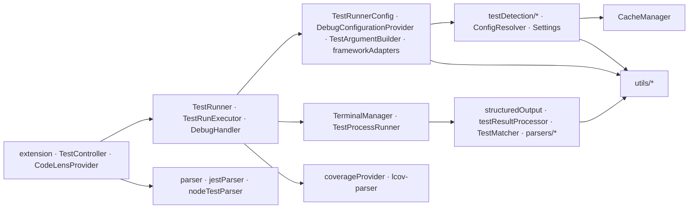

# Module Reference

Every source file under `src/` (tests excluded), what it exports and who depends on it. Paths are relative to
`src/`. The arrows in *Used by* point at the main consumers; `utils/` helpers are used broadly and listed
once.

## Entry point and orchestration

| File | Responsibility | Key exports | Used by |
|---|---|---|---|
| `extension.ts` | Activation: creates `TestRunnerConfig`, `TestRunner`, `TestRunnerCodeLensProvider`; registers all `extension.*` commands wrapped in error handling; maintains the `jestrunner.isTestFile` context key; creates and disposes `JestTestController` on the `enableTestExplorer` setting; clears caches on setting changes | `activate`, `deactivate` | VS Code |
| `testRunner.ts` | Terminal path: run / debug the current test, file or path, run the previous command; finds the test at the cursor; builds the shell command | `TestRunner` | `extension.ts` |
| `testRunnerConfig.ts` | Facade over settings and detection: executable per framework, working directory, config path, argument building, debug configuration, variable resolution | `TestRunnerConfig` | `extension.ts`, `TestController.ts`, `TestRunExecutor`, `DebugHandler`, `TestArgumentBuilder`, `DebugConfigurationProvider` |
| `frameworkAdapters.ts` | Pure argument builders per framework for one file and one test name; the Vitest name pattern; the unquoted batch name filter | `getFrameworkAdapter`, `buildTestNameFilter` | `testRunnerConfig.ts`, `TestArgumentBuilder` |
| `TerminalManager.ts` | The reused `jest` / `vitest` terminal; recreates it when cwd or env change | `TerminalManager` | `testRunner.ts` |
| `TestRunnerCodeLensProvider.ts` | CodeLens per test node and option; groups `each` rows into a quick-pick menu; caches the last good result per file | `TestRunnerCodeLensProvider` | `extension.ts` |
| `util.ts` | `CodeLensOption` type and validation | `validateCodeLensOptions`, `CodeLensOption`, `pushMany` | `config/Settings.ts`, `TestRunnerCodeLensProvider.ts` |

## Test Explorer

| File | Responsibility | Key exports | Used by |
|---|---|---|---|
| `TestController.ts` | Creates the `vscode.TestController`, the four run profiles, the watchers; serializes full discoveries | `JestTestController` | `extension.ts` |
| `testDiscovery.ts` | Workspace scan for test files; folder / file / test item creation; parsing a file into items | `discoverTests`, `findTestFiles`, `getOrCreateFileTestItem`, `getOrCreateFolderTestItem`, `findFileTestItem`, `findFolderTestItem`, `parseTestsInFile`, `processTestNodes` | `TestController.ts`, `TestFileWatcher` |
| `testController/TestRunExecutor.ts` | Run and Coverage handlers: grouping into run contexts, fast vs. standard mode, Windows command length handling, JUnit file pickup, Deno coverage conversion, coverage processing | `TestRunExecutor` | `TestController.ts` |
| `testController/DebugHandler.ts` | Debug profile: finds the first leaf and starts a debug session | `DebugHandler` | `TestController.ts` |
| `testController/TestFileWatcher.ts` | Keeps items in sync with file create / change / delete / open / save; mtime-based re-parse | `TestFileWatcher` | `TestController.ts` |
| `testController/TestConfigWatcher.ts` | Emits a change when settings or any framework config file change; watches custom config paths | `TestConfigWatcher` | `TestController.ts` |
| `execution/TestCollector.ts` | Request → leaves per file; partial-selection check against the file's leaf count | `collectTestsByFile`, `isPartiallySelected` | `TestRunExecutor`, `TestArgumentBuilder` |
| `execution/TestArgumentBuilder.ts` | Batched argument strategies per framework with reporters and coverage flags; fast-mode decision | `buildTestArgs`, `buildTestArgsFast`, `canUseFastMode` | `TestRunExecutor` |
| `execution/TestProcessRunner.ts` | Spawning (shell-less, cmd.exe for `.cmd` shims), streaming with incremental structured parsing, buffer limit, cancellation, process tree kill; fast mode by exit code | `executeTestCommand`, `executeTestCommandFast`, `runsInWindowsShell`, `logTestExecution` | `TestRunExecutor` |
| `testResultProcessor.ts` | Applies results to the `TestRun`: parser selection, file scoping, template aggregation, best match, text fallback | `processTestResults`, `processTestResultsFromParsed` | `TestRunExecutor`, `TestProcessRunner` |
| `testResultTypes.ts` | The `JestResults` shape | `JestResults`, `JestFileResult`, `JestAssertionResult` | all parsers and processors |
| `matchers/TestMatcher.ts` | Result ↔ item matching: exact, templated, retry suffix, ancestor preference, short-name fallback, best unused match by line | `findPotentialMatchesIn`, `findBestMatch`, `hasTemplateVariable` | `testResultProcessor.ts` |
| `coverageProvider.ts` | Coverage directory resolution, JSON and LCOV reading, conversion to `vscode.FileCoverage` and detailed ranges | `CoverageProvider`, `DetailedFileCoverage` | `TestController.ts`, `TestRunExecutor` |

## Test detection

| File | Responsibility | Key exports | Used by |
|---|---|---|---|
| `testDetection/frameworkDefinitions.ts` | Framework names, config file names, binary names, default patterns, coverage constants, shared types | `testFrameworks`, `allTestFrameworks`, `DEFAULT_TEST_PATTERNS`, `TestFrameworkName`, `TestPatterns`, `TestPatternResult`, ... | everything in detection, `TestConfigWatcher`, `coverageProvider`, `ConfigResolver` |
| `testDetection/frameworkDetection.ts` | Which framework owns a file and from which directory: content checks, config files, dependencies, binaries, custom configs, parent directory walk | `findTestFrameworkDirectory`, `detectTestFramework`, `isFrameworkUsedIn`, `isNodeTestFile`, `isBunTestFile`, `isDenoTestFile`, `isPlaywrightTestFile`, `isRstestTestFile`, `getParentDirectories`, `invalidateNodeTestCache` | `testFileDetection.ts`, `testFileCache.ts`, `testRunnerConfig.ts`, `parser.ts`, `TestFileWatcher` |
| `testDetection/testFileDetection.ts` | Which patterns apply to a file (settings, custom configs, parent directories, defaults); pattern match; conflict check; convenience predicates | `matchesTestFilePattern`, `isTestFile`, `isJestTestFile`, `isVitestTestFile`, `getTestFrameworkForFile`, `hasConflictingTestFramework` | `testFileCache.ts`, `testRunnerConfig.ts`, `TestRunExecutor`, `coverageProvider.ts` |
| `testDetection/testFileCache.ts` | The cached "is this a test file, of which framework" decision | `testFileCache` | `extension.ts`, `TestRunnerCodeLensProvider.ts`, `testDiscovery.ts`, `TestFileWatcher`, `TestController.ts` |
| `testDetection/configParsing.ts` | Config file lookup in a directory with the Vite and `package.json` special cases; binary lookup; custom config resolution; default patterns | `getConfigPath`, `binaryExists`, `resolveAndValidateCustomConfig`, `packageJsonHasJestConfig`, `getDefaultTestPatterns` | `frameworkDetection.ts`, `testFileDetection.ts`, `ConfigResolver.ts` |
| `testDetection/patternMatching.ts` | Glob and regex matching with roots, ignore and exclude patterns, `<rootDir>`; Jest-vs-Vitest tie break | `fileMatchesPatternsExplicit`, `detectFrameworkByPatternMatch` | `testFileDetection.ts`, `frameworkDetection.ts` |
| `testDetection/configParsers/parseUtils.ts` | The static config evaluator: bindings, `require()` of local files, export unwrapping | `parseConfigObject`, `readConfigFile` | all config parsers |
| `testDetection/configParsers/jestParser.ts` | Jest patterns (`testMatch`, `testRegex`, `roots`, ignore, `projects`) and coverage directory | `getTestMatchFromJestConfig`, `parseCoverageDirectory` | `testFileDetection.ts`, `patternMatching.ts`, `coverageProvider.ts` |
| `testDetection/configParsers/vitestParser.ts` | Vitest patterns (`include`, `exclude`, `dir`, `root`, `projects`); is a `vite.config` a Vitest config | `getVitestConfig`, `viteConfigHasTestAttribute`, `getIncludeFromVitestConfig` | `testFileDetection.ts`, `patternMatching.ts`, `configParsing.ts` |
| `testDetection/configParsers/playwrightParser.ts` | `testDir`, `testMatch`, `testIgnore` | `getPlaywrightConfig`, `getPlaywrightTestDir` | `testFileDetection.ts` |
| `testDetection/configParsers/rstestParser.ts` | `root`, `include`, `exclude`, `projects` | `getRstestConfig` | `testFileDetection.ts` |
| `testDetection/configParsers/denoParser.ts` | `test.include` / `test.exclude` from `deno.json(c)` | `getDenoConfig` | `testFileDetection.ts` |
| `testDetection/configParsers/cypressParser.ts` | `specPattern`, to exclude Cypress specs | `getCypressSpecPattern` | `testFileDetection.ts` |
| `ConfigResolver.ts` | `jestrunner.configPath` / `vitestConfigPath` resolution incl. glob mappings and nearest-config search; cached per directory | `resolveConfigPath`, `findConfigPath` | `testRunnerConfig.ts` |
| `cache/CacheManager.ts` | Directory-framework, file-framework and config-path caches with targeted invalidation | `cacheManager`, `CacheManager` | detection, `ConfigResolver.ts`, `TestController.ts`, `TestFileWatcher` |
| `config/Settings.ts` | Typed getters for every `jestrunner.*` setting, with array validation and per-framework lookups | `getJestCommand`, `getVitestRunOptions`, `getRunOptionsForFramework`, `getDebugOptionsForFramework`, ... | `testRunnerConfig.ts`, `DebugConfigurationProvider.ts`, `TestConfigWatcher`, `configParsing.ts`, `testDiscovery.ts`, `frameworkDetection.ts` |

## Parsing test files and runner output

| File | Responsibility | Key exports | Used by |
|---|---|---|---|
| `parser.ts` | Chooses the test file parser by framework | `parseTestFile`, `parse` | `testRunner.ts`, `testDiscovery.ts`, `TestRunnerCodeLensProvider.ts` |
| `parsers/jestParser/index.ts` | Public API of the Babel parser | `parse` (default), `getASTfor`, node classes | `parser.ts` |
| `parsers/jestParser/babelParser.ts` | The walker: describe / it / expect detection incl. Playwright and Deno forms, scope bindings, name resolution, `each` expansion with title formatting | `parse`, `getASTfor` | `index.ts` |
| `parsers/jestParser/helper.ts` | Parser plugins per extension, parse options, callee name extraction | `parseOptions`, `getNameForNode`, `getCallExpression`, `shallowAttr`, `jsPlugins`, `tsPlugins`, `tsxPlugins` | `babelParser.ts` |
| `parsers/jestParser/parserNodes.ts` | Node classes: `ParsedNode`, `NamedBlock`, `ItBlock`, `DescribeBlock`, `Expect`, `ParseResult`, `ParsedRange` | the classes | `babelParser.ts`, consumers |
| `parsers/jestParser/types.ts` | `CodeLocation` | `CodeLocation` | parser nodes |
| `parsers/nodeTestParser.ts` | `node:test` file parser with `@babel/traverse`, builds the tree from positions | `parseNodeTestFile`, `TestNode`, `ParseResult` | `parser.ts` |
| `parsers/OutputParser.ts` | Jest and Vitest `--json` output extraction (brace matching inside noisy output) | `parseJestOutput`, `parseVitestOutput`, `convertVitestToJestResults` | `testResultProcessor.ts` |
| `parsers/junitParser.ts` | JUnit XML → `JestResults` (Rstest, Bun, Deno) | `parseJUnitXML` | `testResultProcessor.ts` |
| `parsers/tapParser.ts` | TAP → `JestResults` with subtest nesting and YAML diagnostics (Node.js fallback) | `parseTapOutput` | `testResultProcessor.ts` |
| `parsers/lcov-parser.ts` | LCOV → per-file lines, functions, branches | `parseLcov`, `LcovCoverageData` | `coverageProvider.ts` |
| `reporting/structuredOutput.ts` | The `@@JTR_START::` framing: marker building, incremental extraction, one-shot parse | `extractStructuredMessages`, `parseStructuredResults`, `buildMarker` | `TestProcessRunner.ts`, `testResultProcessor.ts` |
| `reporters/reporterPaths.ts` | Writes the three reporter templates to the temp directory once and returns their paths | `getReporterPaths` | `frameworkAdapters.ts`, `TestArgumentBuilder.ts` |
| `reporters/jestReporterTemplate.js` | Jest reporter emitting a framed `JestResults` block | (file content, bundled as string) | `reporterPaths.ts` |
| `reporters/vitestReporterTemplate.js` | Vitest reporter (`onTestRunEnd` / `onFinished`) emitting the block | | `reporterPaths.ts` |
| `reporters/nodeReporterTemplate.js` | `node:test` reporter generator emitting the block | | `reporterPaths.ts` |

## Debugging

| File | Responsibility | Key exports | Used by |
|---|---|---|---|
| `debug/DebugConfigurationProvider.ts` | Launch configuration per framework: program / runtime resolution, custom command parsing, env merging, user overrides | `getDebugConfiguration` | `testRunnerConfig.ts` |

## Utilities

| File | Responsibility | Key exports |
|---|---|---|
| `utils/ArgUtils.ts` | Merge argument lists without duplicate flags, keeping flag + value pairs together | `appendUniqueArgs`, `prependUniqueArgs` |
| `utils/AstUtils.ts` | Evaluate a Babel AST node to a value (literals, arrays, objects, spreads, templates, members, RegExp) | `astToValue` |
| `utils/Logger.ts` | The **Jest Runner** output channel; `logDebug` gated by `enableDebugLogs` | `logInfo`, `logWarning`, `logError`, `logDebug`, `getOutputChannel` |
| `utils/PathUtils.ts` | Windows detection, slash and drive letter normalization, symlink-resolved runner paths, regex escaping of paths, glob-mapping resolution with a matcher cache | `isWindows`, `normalizePath`, `toRunnerPath`, `escapeRegExpForPath`, `resolveConfigPathOrMapping`, `getDirName`, `getFileName` |
| `utils/ResolverUtils.ts` | Resolve a package's bin from a directory; walk up looking for config names | `resolveBinaryPath`, `resolveConfigPath` |
| `utils/ShellUtils.ts` | ANSI stripping, shell-word parsing, env prefix parsing, unquoting for spawn, `.cmd` shim detection, terminal-shell quoting, cmd.exe quoting | `stripAnsi`, `parseShellCommand`, `parseCommandAndEnv`, `normalizeArgsForNonShellSpawn`, `needsWindowsShell`, `quoteArgsForTerminal`, `quoteForCmd` |
| `utils/TestNameUtils.ts` | Regex escaping, placeholder → `(.*?)`, full name at a line, `.name` / `.prototype.` cleaning, quoting | `escapeRegExp`, `resolveTestNameStringInterpolation`, `toTestNamePattern`, `toTestItemNamePattern`, `findFullTestName`, `updateTestNameIfUsingProperties`, `quote`, `unquote`, `TestNode` |
| `utils/VariableUtils.ts` | `${workspaceFolder}`, `${workspaceRoot}`, `${workspaceFolderBasename}`, `${userHome}`, `${env:X}` substitution | `resolveVariables` |

## Build artifacts

| File | Responsibility |
|---|---|
| `vite-env.d.ts` | Type declarations for the `?raw` imports of the reporter templates |

## Dependency direction

Lower layers never import from higher ones; `vscode` is imported wherever VS Code objects are needed and is
fully mocked in the unit tests.
