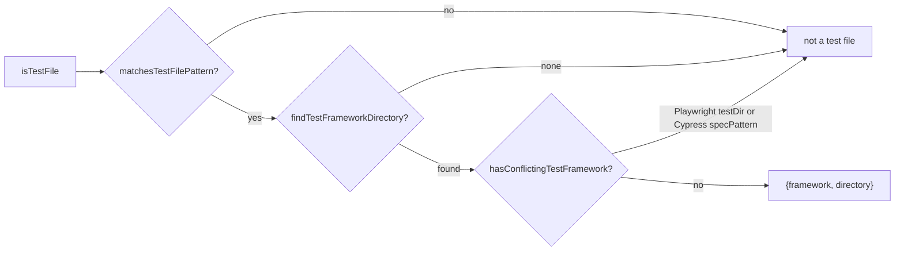
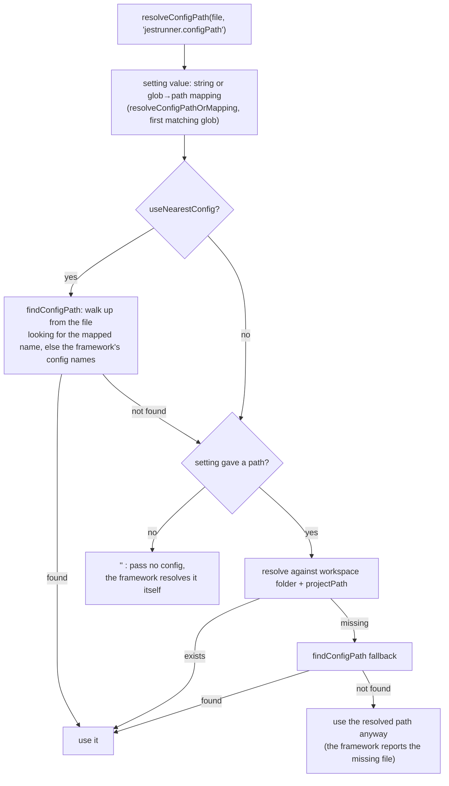

# Test Detection

Everything in Jest Runner starts with one question: **is this file a test, and of which framework?** The
answer decides whether CodeLens appears, whether the file is in the Test Explorer tree, which binary runs it
and from which directory. The code lives in `src/testDetection/` with `ConfigResolver.ts` and
`cache/CacheManager.ts` next to it.

## The three checks

`testFileCache.isTestFile(filePath)` is the single entry point used by the CodeLens provider, the context
menu (`jestrunner.isTestFile` context key), the discovery and the file watchers. It computes, and caches, this:

1. **`matchesTestFilePattern`** (`testFileDetection.ts`): does the file name match the test patterns that
   apply to it? The patterns come from the framework config found for the file, or from
   `jestrunner.defaultTestPatterns`.
2. **`findTestFrameworkDirectory`** (`frameworkDetection.ts`): which framework owns the file and which
   directory is its project directory?
3. **`hasConflictingTestFramework`** (`testFileDetection.ts`): is the file claimed by Playwright (inside its
   `testDir`) or Cypress (matching its `specPattern`) although step 2 said Jest or Vitest? Then it is not shown.

The result (`{ framework, directory }` or `null`) is stored per file in `CacheManager`.

## Step 2 in detail: which framework

`findTestFrameworkDirectory(filePath, targetFramework?)` runs these stages and stops at the first hit:

| Stage | Signal | Result directory |
|---|---|---|
| 1 | File content: `node:test` import | the file's directory |
| 2 | File content: `bun:test` import | the file's directory |
| 3 | File content: `Deno.test(`, `jsr:@std/expect`, `@std/assert`, `https://deno.land/` | the file's directory |
| 4 | File content: `@playwright/test` import (unless `jestrunner.disablePlaywright`) | the file's directory |
| 5 | File content: `@rstest/core` or `rstest` import | nearest directory above with Rstest installed or configured, else the file's directory |
| 6 | Settings: `jestrunner.configPath` / `jestrunner.vitestConfigPath` resolve to an existing file | the workspace folder |
| 7 | Parent directories, from the file upwards to the workspace folder: `detectTestFramework(dir, file)` | that directory |
| 8 | Workspace folder: dependencies, binaries, config files, in the order Vitest, Jest, Bun, Deno, Playwright, Rstest | the workspace folder |

The content checks (stages 1 to 5) read the file once; the result is cached with the file's framework so the
regexes do not run again. Stages 6 to 8 are only reached for Jest, Vitest and configs-only frameworks.

`detectTestFramework(dir, file)` in stage 7 looks at a single directory:

1. the content checks of stages 1 to 5 again (so a `bun:test` file in a Jest package is still Bun),
2. `getConfigPath(dir, 'jest')`, `getConfigPath(dir, 'vitest')`, `getConfigPath(dir, 'rstest')`:
   - both Jest and Vitest present → `detectFrameworkByPatternMatch` (see below), falling back to Jest,
   - only one present → that one,
   - Rstest present → Rstest,
3. a `package.json` with a dependency (or a `jest` / `rstest` key) in `dependencies`, `devDependencies` or
   `peerDependencies`, in the order of `testFrameworks`,
4. an installed binary: `node_modules/.bin/<name>`, `node_modules/.bin/<name>.cmd` or
   `node_modules/<name>/package.json`.

A `vite.config.*` only counts as a Vitest config when its parsed content has a `test` section or `projects`;
a `package.json` only counts as a Jest config when it has a `jest` key (`configParsing.ts`).

When `targetFramework` is given (for example `isJestTestFile` asks for `'jest'`), a hit of another framework
returns `wrong_framework` and the search stops: a Vitest file never becomes a Jest file by looking further up.

### Jest and Vitest in the same directory

`detectFrameworkByPatternMatch(dir, file, jestConfig, vitestConfig)` in `patternMatching.ts` parses both
configs and checks the file against their patterns:

| Jest has explicit patterns | Vitest has explicit patterns | Decision |
|---|---|---|
| yes | yes | the one whose patterns match, `undefined` if both or neither (caller falls back to Jest) |
| yes | no | Jest if its patterns match, else Vitest |
| no | yes | Vitest if its patterns match, else Jest |
| no | no | `undefined` (caller falls back to Jest) |

## Step 1 in detail: which patterns

`getTestFilePatternsForFile(file)` returns a list of `TestPatternResult` (patterns, config directory,
regex or glob, roots, ignore and exclude patterns). The file is a test when any entry matches. The source of
the list, in order of precedence:

1. `jestrunner.disableFrameworkConfig` → the default patterns, relative to the workspace folder.
2. `jestrunner.configPath` and `jestrunner.vitestConfigPath` both set → `resolveDualConfigPatterns`, which
   uses the pattern tie-break above and otherwise the union of both.
3. `jestrunner.configPath` set → the Jest config's patterns.
4. `jestrunner.vitestConfigPath` set → the Vitest config's patterns.
5. `jestrunner.playwrightConfigPath` set → the Playwright config's patterns.
6. Parent directories upwards: the first directory whose framework is detected contributes its config's
   patterns (`findJestConfigInDir`, `findVitestConfigInDir`, `findDenoConfigInDir`,
   `findPlaywrightConfigInDir`, `findRstestConfigInDir`). Each tries the framework's config file names in
   order and takes the first that parses.
7. Nothing found → the default patterns, relative to the workspace folder.

Each config parser returns one entry per project (`projects` in Jest, Vitest and Rstest), with its own
`rootDir`, so a monorepo root config contributes the patterns of all its projects.

### Matching a file

`fileMatchesPatternsExplicit(file, configDir, patterns, isRegex, rootDir, ignore, exclude, roots)`:

1. The path is made relative to `configDir` (or `rootDir` below it) with forward slashes.
2. **Exclusions first**: Jest `testPathIgnorePatterns` are regexes tested against the absolute path (with
   `<rootDir>` removed); Vitest, Rstest and Deno `exclude` are globs tested against the relative path.
3. **Roots**: with Jest `roots`, the file must be below one of them (`<rootDir>` resolved).
4. **Patterns**: regexes (Jest `testRegex`, Playwright `RegExp`) are tested against the absolute path; globs
   (`testMatch`, `include`, defaults) against the relative path with `<rootDir>` resolved, case-insensitively,
   through `micromatch`.

## Step 3 in detail: conflicts

`hasConflictingTestFramework(file, framework)` walks the parent directories and, for every *other* framework
in `allTestFrameworks` with a config file there:

- **Playwright**: if the file is inside `testDir` (default `tests` when the config cannot be parsed), it is
  a Playwright file, not a Jest or Vitest one. This keeps end-to-end specs that happen to be named
  `*.spec.ts` out of the unit test runner.
- **Cypress**: if the file matches `specPattern` of `cypress.config.*`, it is excluded altogether, because
  Jest Runner does not run Cypress.

## Config path resolution for a run

Detection tells which framework; `ConfigResolver.ts` tells which config file to pass on the command line
(`-c` for Jest, `--config` for Vitest and Rstest). It is deliberately conservative:

Passing **no** config when nothing is configured is intentional: Jest, Vitest and Rstest find their own config
from the working directory, and for monorepos that is the right one. `getTestRunCwd` picks that working
directory: `jestrunner.projectPath` if set, else the project directory detection found (for Jest, Vitest,
Rstest), else the directory of the nearest `deno.json`, `bun.lock` or `playwright.config.*`, else the
nearest `package.json`, else the workspace folder.

`findConfigPath` caches per directory and config name list: all files of a directory share one lookup.

## The caches

`CacheManager` (a singleton) holds three maps:

| Cache | Key | Value | Filled by |
|---|---|---|---|
| directory framework | directory + framework name | `boolean` (is the framework used there) | `isFrameworkUsedIn` |
| file framework | file path | `{ framework, directory }` or `null` | `testFileCache.isTestFile`, the content checks |
| config path | `config:<dir>:<names>` | path or `undefined` (a miss is cached too) | `findConfigPath` |

Invalidation:

- a `jestrunner.*` setting change → everything (`extension.ts`),
- a Test Explorer refresh (config file created, changed or deleted; settings changed) → everything,
- a file saved or changed on disk → that file (`TestFileWatcher`), so a newly added `bun:test` import is
  picked up,
- a file deleted → that file and every config cache entry containing its path.

The parsed configs themselves are not cached: each parser reads and parses the file on every call. The
file-level cache in front of it means a file is only classified once until something changes.

## Where detection is called from

| Caller | Function | Why |
|---|---|---|
| `extension.ts` | `testFileCache.isTestFile` | sets the `jestrunner.isTestFile` context for the editor menu |
| `TestRunnerCodeLensProvider` | `testFileCache.isTestFile` | only test files get CodeLens |
| `testDiscovery.findTestFiles` | `testFileCache.isTestFile` | filters the workspace scan |
| `TestFileWatcher` | `testFileCache.isTestFile` | adds created / opened / saved files |
| `TestRunnerConfig.getTestCommand`, `buildTestArgs`, `getTestFramework` | `getTestFrameworkForFile` | picks the binary and the adapter |
| `TestRunnerConfig.getTestRunCwd`, `getPackagePath` | `findTestFrameworkDirectory` | working directory |
| `TestRunExecutor.createRunContexts` | `getTestFrameworkForFile` | groups files by framework |
| `DebugConfigurationProvider` | `config.getTestFramework` | picks the debug config builder |
| `parser.ts` | `isNodeTestFile` | picks the test file parser |
| `coverageProvider.shouldIgnoreFile` | `matchesTestFilePattern` | hides test files from the coverage view |
