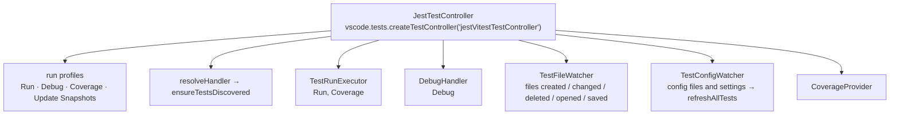

# Test Explorer

With `jestrunner.enableTestExplorer`, Jest Runner registers a `vscode.TestController` and fills the native
**Testing** view. The code is `src/TestController.ts`, `src/testDiscovery.ts` and the helpers in
`src/testController/`.

## Lifecycle

`extension.ts` creates the `JestTestController` when the setting is on and a workspace folder exists, and
disposes it when the setting is switched off. The constructor wires up:

| Profile | Kind | Handler | Default |
|---|---|---|---|
| Run | `Run` | `TestRunExecutor.runHandler` | yes |
| Debug | `Debug` | `DebugHandler.debugHandler` | yes |
| Coverage | `Coverage` | `TestRunExecutor.coverageHandler`, with `loadDetailedCoverage` for the inline details | yes |
| Update Snapshots | `Run` | `TestRunExecutor.runHandler` with `['-u']` | no |

Every handler first awaits `ensureTestsDiscovered()`, so a run requested before the first scan (or during a
refresh) sees the complete tree.

## Discovery

`discoverAllTests()` clears all caches and the tree, then runs `discoverTests` for each workspace folder:

1. `findTestFiles` scans with `vscode.workspace.findFiles('**/*.{js,jsx,ts,tsx,mjs,cjs,mts,cts}', '**/node_modules/**')`
   below the workspace folder (or `jestrunner.projectPath`), and keeps the files for which
   `testFileCache.isTestFile` is true. The check runs in batches of 50 with a `setImmediate` yield in between,
   so a large workspace does not freeze the extension host.
2. For each test file, `getOrCreateFileTestItem` creates the **folder chain** (`getOrCreateFolderTestItem`,
   one item per directory level, id = absolute path) and the **file item** (id = absolute path, label = base
   name).
3. `parseTestsInFile` parses the file (see [Test File Parsing](test-parsing.md)) and `processTestNodes` adds
   one item per `describe`/`it`: id `<file>:<type>:<line>:<full name>`, label = the (cleaned) name, `range`
   from the node position, tag `suite` or `test`. Children are nested under their `describe`.

The tree is therefore: workspace folder → folders → file → describe → test. Folder and file items carry
`canResolveChildren = false`; the whole tree is built eagerly.

### Refresh coordination

`refreshAllTests()` serializes discoveries: a refresh requested while one is running is queued, and a second
request while one is queued returns the queued promise. A burst of config changes (an `npm install` touching
many files, a branch switch) therefore costs at most two full discoveries, and two discoveries never clear
each other's items mid-way. `ensureTestsDiscovered()` awaits a running or queued refresh before a run.

## Keeping the tree in sync (`TestFileWatcher`)

| Event | Action |
|---|---|
| file changed on disk | invalidate its detection cache; if it has an item, re-parse (`reparse`) |
| file created | if it is a test file, create its item and parse it |
| file deleted | invalidate caches, remove the item from the root and from its folder item |
| document opened | if it is a test file without children yet, create and parse |
| document saved | invalidate, create the item if missing, re-parse |
| extension start | parse every already open test document |

`reparse` compares the file's modification time with the one it last parsed: a save fires both the save event
and the file system watcher, and the second one finds the file unchanged and does nothing. Re-parsing replaces
the file item's children, so ids of moved tests change and VS Code updates the view.

## Re-discovering on config changes (`TestConfigWatcher`)

Fires `onDidChange` (→ `refreshAllTests`) when:

- a `jestrunner.*`, `jest.*` or `vitest.*` setting changes,
- any file matching `**/<config file>` of any framework (`frameworkDefinitions.testFrameworks[].configFiles`,
  that is `jest.config.*`, `package.json`, `vitest.config.*`, `vite.config.*`, `bun.lock`, `deno.json`,
  `playwright.config.*`, `rstest.config.*`) is created, changed or deleted,
- a file named in `jestrunner.configPath` or `jestrunner.vitestConfigPath` (string or mapping values) is
  created, changed or deleted; these watchers are rebuilt when the settings change.

Because `package.json` is among the config files, installing a dependency triggers a refresh, which is how a
freshly added framework is picked up without reloading the window.

## Running

See [Command Building & Execution](execution.md#the-test-explorer-path) for `TestRunExecutor`, and
[Reporters & Result Matching](results.md) for how states come back. In short: collect leaves per file, group
into contexts by framework / cwd / config / selection, one process per context, stream results, add coverage.

## Debugging (`DebugHandler`)

The debug profile walks the requested items breadth-first, skips excluded ones, descends into containers and
**debugs the first leaf it reaches** (a debug session is one process; several tests would need several
sessions). The name pattern comes from the item id (`toTestItemNamePattern`), the launch configuration from
`TestRunnerConfig.getDebugConfiguration(file, name)` (see [Debugging](debugging.md)), and
`vscode.debug.startDebugging(workspaceFolder, config)` starts it. Debugging a file item passes no name, so the
whole file runs.

## Coverage

The Coverage profile runs like Run with `collectCoverage = true`. After the process, `processCoverageData`
asks `CoverageProvider` for a `CoverageMap`, converts it to `DetailedFileCoverage` objects (a
`vscode.FileCoverage` subclass carrying the raw data) and adds them to the run. When the user opens a file in
the coverage view, VS Code calls the profile's `loadDetailedCoverage`, which turns the raw statement, branch
and function maps into `vscode.StatementCoverage`, `BranchCoverage` and `DeclarationCoverage` ranges. See
[Coverage](coverage.md).

## IDs and labels, and why they matter

- Folder and file ids are absolute paths. `TestCollector.findFileItem` walks up from a leaf to the item whose
  id is the file path to count the file's leaves for the partial-selection check.
- Test ids embed the type, the line and the **full name** (ancestors included). `toTestItemNamePattern`
  extracts that name to build the `-t` pattern, so the filter uses the real name even when the label was
  cleaned (`Foo.prototype.bar.name` → `bar`) or the item is an `each` row.
- Labels are what `TestMatcher` compares with result titles; parent labels are the ancestor titles.
